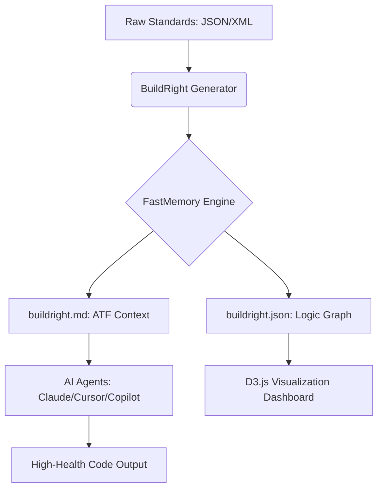

# 🛡️ BuildRight: The "Horizontal Layer of Truth" for AI Engineering

[](https://github.com/FastBuilderAI/memory)
[](https://owasp.org/www-project-top-ten/)
[](https://en.wikipedia.org/wiki/SOLID)
[](#claude-plugin-integration)

**BuildRight** is an ontological engineering layer designed to ensure every line of code generated or reviewed by AI follows strict industry standards. It eliminates the need for manual `claude.md` or `agent.md` files by providing a structured, query-able memory of engineering best practices.

---

## 📽️ Ontological Architecture



---

## 🧠 Core Engineering Frameworks

BuildRight ships with pre-clustered ontological memories for:
- **Security**: Full OWASP Top 10 (2021) and critical CWE Top 25 preventions.
- **Architecture**: SOLID Principles and the Twelve-Factor App methodology.
- **Hygiene**: Clean Code standards (DRY, KISS, YAGNI, Boy Scout Rule).
- **Custom**: Easy ingestion of enterprise-specific XML/JSON standards.

---

## 🚀 Quick Start

### 1. Installation
```bash
pip install -r requirements.txt
```

### 2. Generate Logic Graph
```bash
python3 generate.py
```

### 3. Interactive Visualization
Simply open **`index.html`** in your browser to explore the ontological clusters of engineering health.

---

## 🔌 Claude Plugin Integration

BuildRight is optimized for the **Model Context Protocol (MCP)** and Claude Projects.

### Option A: Claude Desktop (MCP) - Recommended
Run the BuildRight MCP server to give Claude real-time "tools" to query engineering standards:
```bash
python3 mcp_server.py
```

### Option B: Claude Projects
Upload **`claude_plugin.md`** and **`buildright.md`** to your Claude Project Knowledge base to establish it as the source of truth for all generations.

---

## 🛠️ Modularity
To add your own standards, drop any `.json` or `.xml` file into the `frameworks/` directory and rerun `generate.py`. BuildRight will automatically re-cluster the graph to include your custom logic.

---

## ⚖️ License
MIT License. Built with ❤️ by the FastBuilder AI team.
