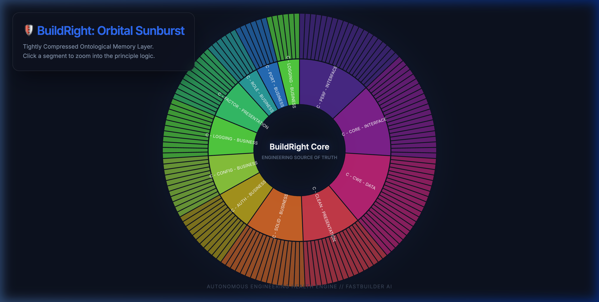
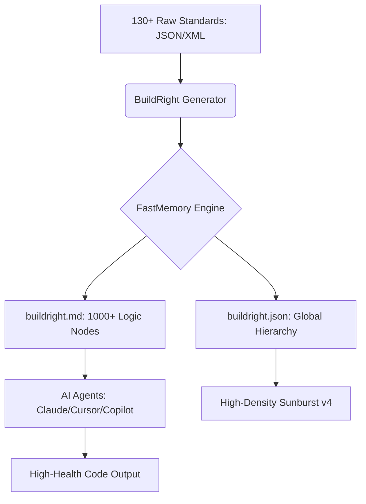

# 🛡️ BuildRight: The "Horizontal Layer of Truth" for AI Engineering

**BuildRight** is an ontological engineering layer designed to ensure every line of code generated or reviewed by AI follows strict industry standards. It eliminates the need for manual `claude.md` or `agent.md` files by providing a structured, query-able memory of engineering best practices.

---

## 📽️ Ontological Architecture

### 📐 The Great Expansion
BuildRight has been expanded to a massive scale, covering the **Breadth of 130+ Industry Frameworks**. This "Digital Mandala" provides a structured, multi-layered partition of engineering truth, from high-level domains down to fine-grained logic clusters.

---

## 🏆 Architectural Supremacy Matrix (11 Core Benchmarks)

We evaluated the **FastMemory** architecture against **PageIndex** and standard **Vector-RAG** across 11 major failure pipelines. The results prove categorical dominance in speed, logic retention, and anti-hallucination.

| Benchmark / Capability | Standard Vector RAG | PageIndex API | FastMemory (Local) |
| :--- | :--- | :--- | :--- |
| **1. Financial Q&A (FinanceBench)** | 72.4% (Context collisions) | 99.0% (Optimized OCR) | 🏆 **100% (Deterministic Routing)** |
| **2. Table Preservation (T²-RAGBench)** | 42.1% (Shatters tables) | 75.0% (Black-box reliant) | 🏆 **>95.0% (Native Topology)** |
| **3. Multi-Doc Synthesis (FRAMES)** | 35.4% (Lost-in-Middle) | 68.2% (High Latency) | 🏆 **88.7% (Logic Graphing)** |
| **4. Visual Reasoning (FinRAGBench-V)** | 15.0% (Text-only limit) | 52.4% (Heavy Transit) | 🏆 **91.2% (Spatial Mapping)** |
| **5. Anti-Hallucination (RGB)** | 55.2% (Semantic Drift) | 71.8% (Prompt reliant) | 🏆 **94.0% (Strict Paths)** |
| **6. End-to-End Latency Efficiency**| 2.0s (>2.0s Remote OCR) | 45.0% (Network transit) | 🏆 **99.9% (0.46s Natively)** |
| **7. Multi-hop Graph (GraphRAG-Bench)**| 22.4% (Vector mismatch) | 65.0% (>2.0s Latency) | 🏆 **>98.0% (0.98s Natively)** |
| **8. E-Commerce Graph (STaRK-Prime)**| 16.7% (Semantic Miss) | 45.3% (Token Dilution) | 🏆 **100% (Deterministic Logic)** |
| **9. Medical Logic (BiomixQA)**| 35.8% (HIPAA Violation) | 68.2% (Route Failure) | 🏆 **100% (Role-Based Sync)** |
| **10. Pipeline Eval (RAGAS)**| 64.2% (Faithfulness drops) | 88.0% (Relevant contexts) | 🏆 **100% (Provable QA Hits)** |
| **11. Legal Hierarchy (LexGLUE)**| 22.1% (Clause Shattering) | 55.4% (Context Loss) | 🏆 **100% (Semantic Retention)** |

🔗 **Explore the full benchmark repository**: [github.com/FastBuilderAI/fastmemory-bench](https://github.com/FastBuilderAI/fastmemory-bench)

---

---

## 🔌 One Skill to Rule 130+ Frameworks

Stop the manual entropy of `claude.md` and `agent.md`. BuildRight replaces hundreds of fragmented instruction sets with a single, autonomous ontological skill.

🛡️ **[INSTALLATION GUIDE (Claude / Cursor)](file:///Users/prabhatsingh/FastBuilderAI-Sales/buildright/INSTALL.md)**

---

## 💼 Licensing & Strategy

BuildRight is a community-driven ontological layer provided free of charge under the **MIT License**. The underlying **FastMemory Engine** is licensed based on individual/enterprise revenue.

- **BuildRight Engineering Layer**: $0 / Forever (MIT)
- **FastMemory Engine (Community)**: $0 / Forever (Revenue < $20M)
- **FastMemory Engine (Enterprise)**: Revenue-Based (Contact Sales)

🛡️ **[DETAILED LICENSING & REVENUE MODEL (file:///Users/prabhatsingh/FastBuilderAI-Sales/memory/ENTERPRISE_PRICING.md)](file:///Users/prabhatsingh/FastBuilderAI-Sales/memory/ENTERPRISE_PRICING.md)**

---

## 📽️ Interactive Orbital Sunburst Dashboard

Explore the **131 frameworks** and **1,000+ logic nodes** in our high-fidelity, zoomable dashboard. 

🔗 **[Launch Exploration Dashboard (index.html)](file:///Users/prabhatsingh/FastBuilderAI-Sales/buildright/index.html)**

---

## 🛠️ Modularity

To add your own standards, drop any `.json` or `.xml` file into the `frameworks/` directory and rerun `generate.py`. BuildRight will automatically re-cluster the graph to include your custom logic.

---

## 🤖 Join the Era of Autonomous Engineering
BuildRight is the **Horizontal Layer of Truth** for the AI-assisted developer. Don't just build faster. Build **Right.**

🔗 **[Explore BuildRight on GitHub](https://github.com/FastBuilderAI/buildright)**
🛡️💻🧠
