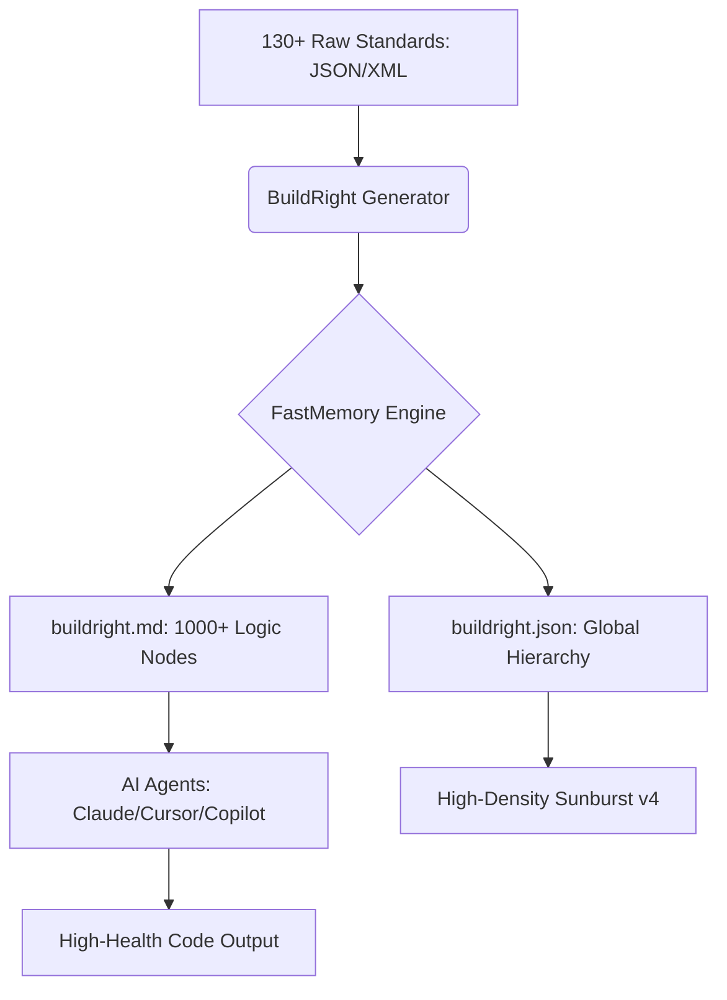

# 🛡️ BuildRight: The "Horizontal Layer of Truth" for AI Engineering

[](https://github.com/FastBuilderAI/memory)
[](https://owasp.org/www-project-top-ten/)
[](https://en.wikipedia.org/wiki/SOLID)
[](#claude-plugin-integration)

**BuildRight** is an ontological engineering layer designed to ensure every line of code generated or reviewed by AI follows strict industry standards. It eliminates the need for manual `claude.md` or `agent.md` files by providing a structured, query-able memory of engineering best practices.

---

## 📽️ Ontological Architecture


### 📐 The Great Expansion
BuildRight has been expanded to a massive scale, covering the **Breadth of 130+ Industry Frameworks**. This "Digital Mandala" provides a structured, multi-layered partition of engineering truth, from high-level domains down to fine-grained logic clusters.



---

## 🧠 130+ Core Engineering Frameworks

BuildRight now ships with a massive breadth of pre-clustered ontological memories. Use the **Exploration Dashboard** to drill into the specific logic layers for any of the following:

| | | | | |
| :--- | :--- | :--- | :--- | :--- |
| **ADONISJS** | **ADONISJS** | **AGILE** | **AIRFLOW** | **ALPINEJS** |
| **ANGULAR** | **ANSIBLE** | **ANTHROPIC** | **ARM** | **ASPNET** |
| **ASYNCAPI** | **ACTIX** | **ADONISJS** | **AWS** | **AXUM** |
| **AZURE** | **BEEGO** | **BOOTSTRAP** | **BUFFALO** | **CASSANDRA** |
| **CELERY** | **CHAI** | **CHROMADB** | **CIS** | **CLOUDFOUNDRY** |
| **COUCHDB** | **CYPRESS** | **DAGSTER** | **DASH** | **DATABASES** |
| **DEVSECOPS** | **DJANGO** | **DOCKER** | **DOTNET_CORE** | **DYNAMODB** |
| **ECHO** | **EBPF** | **ELECTRON** | **EXPRESS** | **FASTAPI** |
| **FASTIFY** | **FIBER** | **FINOPS** | **FLASK** | **FLINK** |
| **FLUTTER** | **FREERTOS** | **GCP** | **GDPR** | **GIN** |
| **GO** | **GRAPHQL** | **GRPC** | **HADOOP** | **HAYSTACK** |
| **HELM** | **HIPAA** | **HUGGINGFACE** | **ISO_27001** | **JAVA** |
| **JAVAEE** | **JEST** | **JETPACKCOMPOSE** | **JUNIT** | **KAFKA** |
| **KANBAN** | **KISS** | **KOA** | **KOTLIN_MP** | **KUBERNETES** |
| **LANGCHAIN** | **LARAVEL** | **LINUX_KERNEL** | **LIT** | **LLAMAINDEX** |
| **METADATA** | **MICRONAUT** | **MONGODB** | **MYSQL** | **NEO4J** |
| **NESTJS** | **NEXTJS** | **NIST** | **NODEJS** | **NUXT** |
| **ODATA** | **OPENAPI** | **OPENAI_API** | **OPENSTACK** | **ORACLE** |
| **OWASP_ASVS** | **OWASP_SAMM** | **PCIDSS** | **PHOENIX** | **PINECONE** |
| **PLAY** | **PLAYWRIGHT** | **POEM** | **POSIX** | **POSTGRESQL** |
| **PULUMI** | **PYRAMID** | **PYTEST** | **PYTORCH** | **QUARKUS** |
| **RABBITMQ** | **RAILS** | **REACT** | **REACT_NATIVE** | **REDIS** |
| **REMIX** | **REST** | **ROCKET** | **RUST** | **SCIKITLEARN** |
| **SCRUM** | **SELENIUM** | **SERVERLESS** | **SOAP** | **SOC2** |
| **SOLIDJS** | **SPARK** | **SPRING_BOOT** | **SQLITE** | **SRE** |
| **SVELTE** | **SWIFTUI** | **SYMFONY** | **TAILWIND** | **TAURI** |
| **TENSORFLOW** | **TERRAFORM** | **TRPC** | **VITEST** | **VUE** |
| **WARP** | **WASM** | **WINDOWS_API** | **YAGNI** | **ZOD** |

---

## 🚀 Quick Start

### 1. Installation
```bash
pip install -r requirements.txt
```

### 2. Generate Logic Graph
```bash
python3 generate.py
```

### 3. Interactive Visualization
Simply open **`index.html`** in your browser to explore the ontological clusters of engineering health.

---

## 🔌 Claude Plugin Integration

BuildRight is optimized for the **Model Context Protocol (MCP)** and Claude Projects.

### Option A: Claude Desktop (MCP) - Recommended
Run the BuildRight MCP server to give Claude real-time "tools" to query engineering standards:
```bash
python3 mcp_server.py
```

### Option B: Claude Projects
Upload **`claude_plugin.md`** and **`buildright.md`** to your Claude Project Knowledge base to establish it as the source of truth for all generations.

### Option C: Claude Code (CLI)
For developers using the **Claude Code** terminal interface, BuildRight can be installed by adding the official marketplace definition:

```bash
# In your terminal (with Claude Code running)
/plugin marketplace add https://raw.githubusercontent.com/FastBuilderAI/buildright/main/.claude-plugin/marketplace.json

# Then install the plugin
/plugin install buildright
```

### Option D: Cursor (via Plugin Marketplace)
In **Cursor Agent** chat, install directly from the marketplace:

```bash
/add-plugin buildright
```

---

## 🛠️ Modularity
To add your own standards, drop any `.json` or `.xml` file into the `frameworks/` directory and rerun `generate.py`. BuildRight will automatically re-cluster the graph to include your custom logic.

---

## ⚖️ License
MIT License. Built with ❤️ by the FastBuilder AI team.
